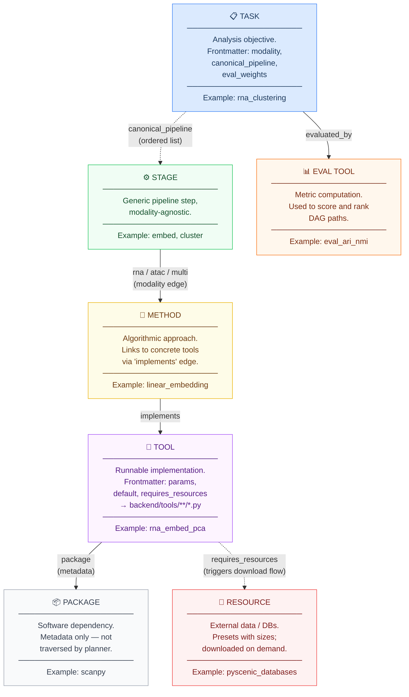
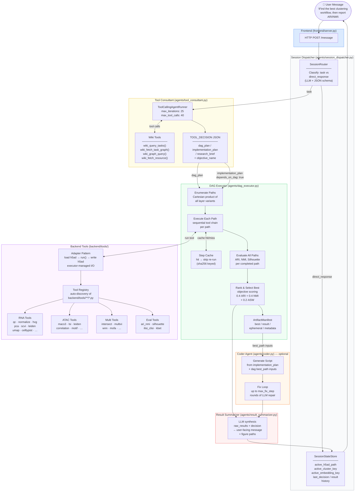
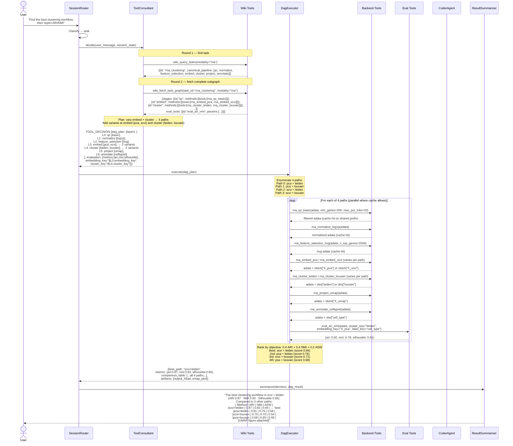

# Architecture Figures

## Figure 1 — Wiki Knowledge Graph

### 1a — Node Types & Edge Schema

---

### 1b — All Current Nodes

```mermaid
flowchart LR

    subgraph TASKS["📋 Tasks  (18)"]
        direction TB
        subgraph RNA_T["RNA  (8)"]
            direction LR
            t1[rna_clustering]
            t2[rna_cell_type_annotation]
            t3[rna_batch_correction]
            t4[rna_differential_expression]
            t5[rna_differential_abundance]
            t6[rna_grn_inference]
            t7[rna_gene_programs]
            t8[rna_trajectory]
        end
        subgraph ATAC_T["ATAC  (7)"]
            direction LR
            t9[atac_clustering]
            t10[atac_cell_type_annotation]
            t11[atac_batch_correction]
            t12[atac_differential_accessibility]
            t13[atac_motif_analysis]
            t14[atac_peak_to_gene]
            t15[atac_grn_inference]
        end
        subgraph MULTI_T["Multi  (3)"]
            direction LR
            t16[multiomic_integration]
            t17[multi_cell_type_annotation]
            t18[multi_batch_correction]
            t19[multi_grn_inference]
        end
    end

    subgraph STAGES["⚙️ Stages  (17)"]
        direction LR
        s1[qc] 
        s2[normalize] 
        s3[feature_selection]
        s4[embed] 
        s5[batch_integration] 
        s6[cluster]
        s7[project] 
        s8[annotate] 
        s9[de]
        s10[da] 
        s11[peak_calling] 
        s12[peak_to_gene]
        s13[grn_inference] 
        s14[motif] 
        s15[gene_programs]
        s16[trajectory] 
        s17[differential_abundance]
    end

    subgraph METHODS["🧠 Methods  (35)"]
        direction TB
        subgraph QC_M["QC"]
            m1[basic_filter]
            m2[doublet_detection]
        end
        subgraph NORM_M["Normalize"]
            m3[library_size_normalization]
            m4[variance_stabilization]
        end
        subgraph FEAT_M["Feature"]
            m5[highly_variable_genes]
            m6[highly_variable_peaks]
        end
        subgraph EMBED_M["Embed"]
            m7[linear_embedding]
            m8[deep_generative_embedding]
            m9[spectral_embedding]
            m10[joint_embedding]
        end
        subgraph INT_M["Integration"]
            m11[embedding_correction]
            m12[graph_correction]
        end
        subgraph CLUST_M["Cluster"]
            m13[graph_based_clustering]
            m14[clustering_metrics]
        end
        subgraph PROJ_M["Project"]
            m15[nonlinear_projection]
        end
        subgraph ANN_M["Annotate"]
            m16[marker_based_annotation]
            m17[reference_based_annotation]
            m18[llm_based_annotation]
        end
        subgraph DE_M["DE"]
            m19[pseudobulk_de]
            m20[statistical_de]
            m21[mixed_model_de]
        end
        subgraph DA_M["DA"]
            m22[pseudobulk_da]
            m23[statistical_da]
            m24[neighborhood_da]
            m25[cluster_proportion_da]
        end
        subgraph PEAK_M["Peak"]
            m26[macs_peak_calling]
        end
        subgraph P2G_M["Peak2Gene"]
            m27[correlation_peak2gene]
        end
        subgraph MOTIF_M["Motif"]
            m28[motif_scanning]
            m29[motif_enrichment]
        end
        subgraph GRN_M["GRN"]
            m30[prior_knowledge_grn]
            m31[coexpression_grn]
        end
        subgraph PROG_M["Programs"]
            m32[nmf_programs]
            m33[mofa_programs]
        end
        subgraph TRAJ_M["Trajectory"]
            m34[diffusion_pseudotime]
        end
        subgraph BATCH_M["Batch"]
            m35[batch_metrics]
        end
    end

    subgraph TOOLS["🔧 Tools  (55)"]
        direction TB
        subgraph RNA_TOOLS["RNA Tools  (34)"]
            direction LR
            subgraph RQCA["QC"]
                rl1[rna_qc_basic]
                rl2[rna_qc_scrublet]
            end
            subgraph RNORM["Normalize"]
                rl3[rna_normalize_log1p]
                rl4[rna_normalize_sctransform]
                rl5[rna_normalize_scran]
            end
            subgraph RFEAT["Feature"]
                rl6[rna_feature_selection_scanpy_hvg]
                rl7[rna_feature_selection_seurat_v3]
                rl8[rna_feature_selection_cellranger]
            end
            subgraph REMB["Embed"]
                rl9[rna_embed_pca]
                rl10[rna_embed_scvi]
                rl11[rna_embed_scanvi]
                rl12[rna_embed_seurat_pca]
            end
            subgraph RINT["Integrate"]
                rl13[rna_batch_integration_harmony]
                rl14[rna_batch_integration_bbknn]
                rl15[rna_batch_integration_scanorama]
            end
            subgraph RCLUST["Cluster"]
                rl16[rna_cluster_leiden]
                rl17[rna_cluster_louvain]
            end
            subgraph RPROJ["Project"]
                rl18[rna_project_umap]
                rl19[rna_project_tsne]
            end
            subgraph RANN["Annotate"]
                rl20[rna_annotate_celltypist]
                rl21[rna_annotate_cellmarker]
                rl22[rna_annotate_gpt4]
                rl23[rna_annotate_azimuth]
                rl24[rna_annotate_singler]
                rl25[rna_annotate_scarches]
            end
            subgraph RDE["DE"]
                rl26[rna_de_wilcoxon]
                rl27[rna_de_ttest]
                rl28[rna_de_pseudobulk]
                rl29[rna_de_edger]
                rl30[rna_de_mast]
            end
            subgraph RGRN["GRN"]
                rl31[rna_grn_decoupler]
                rl32[rna_grn_grnboost2]
                rl33[rna_grn_pyscenic]
            end
        end
        subgraph ATAC_TOOLS["ATAC Tools  (15)"]
            direction LR
            subgraph AQCA["QC"]
                al1[atac_qc_basic]
                al2[atac_qc_fragment_size]
            end
            subgraph AFEAT["Feature"]
                al3[atac_feature_selection_peaks]
            end
            subgraph AEMB["Embed"]
                al4[atac_embed_lsi]
            end
            subgraph AINT["Integrate"]
                al5[atac_batch_integration_harmony]
            end
            subgraph ACLUST["Cluster"]
                al6[atac_cluster_leiden]
                al7[atac_cluster_louvain]
            end
            subgraph APROJ["Project"]
                al8[atac_project_umap]
            end
            subgraph AANN["Annotate"]
                al9[atac_annotate_gene_activity]
                al10[atac_annotate_marker_peaks]
            end
            subgraph APEAK["Peak Calling"]
                al11[atac_peak_calling_macs2]
                al12[atac_peak_calling_macs3]
            end
            subgraph ADA["DA"]
                al13[atac_da_wilcoxon]
            end
            subgraph AP2G["Peak2Gene"]
                al14[atac_peak_to_gene_correlation]
            end
            subgraph AMOTIF["Motif"]
                al15[atac_motif_enrichment]
            end
        end
        subgraph MULTI_TOOLS["Multi Tools  (4)"]
            direction LR
            ml1[multi_qc_intersect]
            ml2[multi_embed_multivi]
            ml3[multi_embed_wnn]
            ml4[multi_embed_mofa]
        end
        subgraph EVAL_TOOLS["Eval Tools  (4)"]
            direction LR
            ev1[eval_ari_nmi]
            ev2[eval_silhouette]
            ev3[eval_ilisi_clisi]
            ev4[eval_kbet]
        end
    end

    subgraph PACKAGES["📦 Packages  (20)"]
        direction LR
        p1[scanpy] 
        p2[scvi_tools] 
        p3[leidenalg]
        p4[celltypist] 
        p5[harmonypy] 
        p6[bbknn]
        p7[scanorama] 
        p8[sklearn] 
        p9[snapatac2]
        p10[macs2] 
        p11[macs3] 
        p12[muon]
        p13[pyscenic] 
        p14[openai] 
        p15[pydeseq2]
        p16[decoupler] 
        p17[scib_metrics] 
        p18[milopy]
        p19[diffxpy] 
        p20[statsmodels]
    end

    subgraph RESOURCES["💾 Resources  (3)"]
        direction LR
        r1[pyscenic_databases]
        r2[pbmc_3k]
        r3[pbmc_multiome_10k]
    end

    TASKS -->|"canonical_pipeline\n→ ordered stage list"| STAGES
    TASKS -->|"evaluated_by"| TOOLS
    STAGES -->|"rna / atac / multi\nedge"| METHODS
    METHODS -->|"implements"| TOOLS
    TOOLS -->|"package"| PACKAGES
    TOOLS -.->|"requires_resources"| RESOURCES

    style TASKS fill:#dbeafe,stroke:#3b82f6
    style STAGES fill:#f0fdf4,stroke:#22c55e
    style METHODS fill:#fefce8,stroke:#eab308
    style TOOLS fill:#fdf4ff,stroke:#a855f7
    style PACKAGES fill:#f9fafb,stroke:#9ca3af
    style RESOURCES fill:#fef2f2,stroke:#ef4444
    style RNA_T fill:#eff6ff,stroke:#93c5fd
    style ATAC_T fill:#eff6ff,stroke:#93c5fd
    style MULTI_T fill:#eff6ff,stroke:#93c5fd
    style RNA_TOOLS fill:#faf5ff,stroke:#d8b4fe
    style ATAC_TOOLS fill:#faf5ff,stroke:#d8b4fe
    style MULTI_TOOLS fill:#faf5ff,stroke:#d8b4fe
    style EVAL_TOOLS fill:#fff7ed,stroke:#fdba74
```

---

## Figure 2 — Agent System Flow

---

## Figure 3 — Example: "Find the best clustering workflow, then report ARI/NMI"

